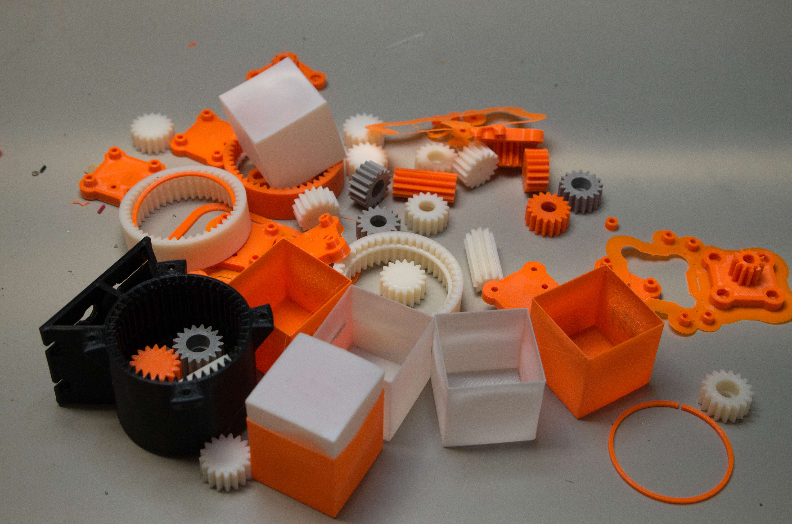
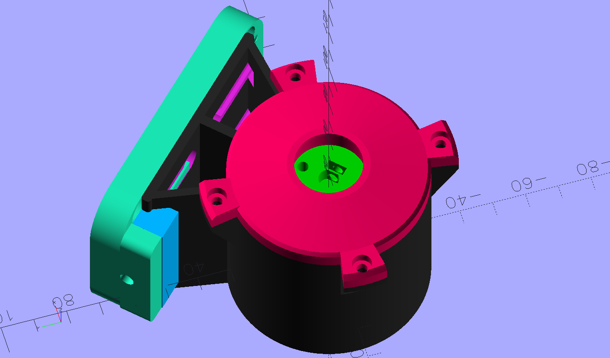
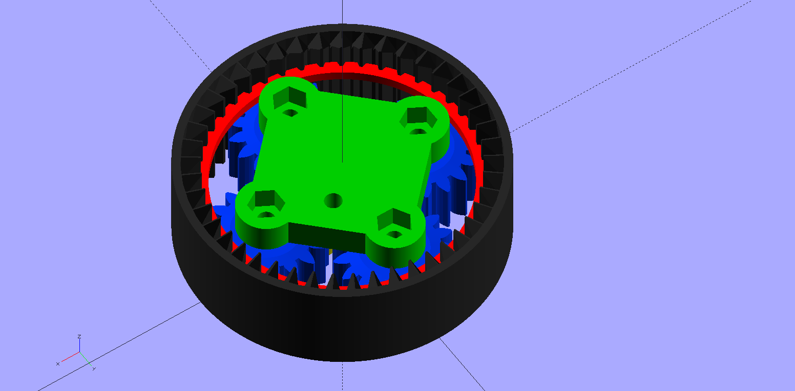

<h1>Mostly Plastic GOTO for my Mostly Plastic Telescope</h1>

<pre>
Credits: 
    @Maff at https://kissner-optik.netlify.app/ for the Hadley and Caroline projects.
    3D model for GT2 pulleys I very slightly modified from http://www.thingiverse.com/thing:16627
    3D model for threaded screw and bolt holes using https://github.com/rcolyer/threads-scad
    the MCAD library for involute gears as distributed with Openscad
    OnStepX at https://onstep.groups.io/g/main/wiki
    at least one STEP model for a hardware item from http://mcmaster.com
    at least one STEP model for an electronic part from http://digikey.com
</pre>
Each of the above has its own license for sharing and attribution.  

This repository hosts 
the design of a GOTO stepper system for my mostly plastic 6 inch telescope, the Caroline
variant of the easy-to-build 4 inch Hadley telescope. The files here are licensed according to <a href='LICENSE'>LICENSE</a> by me, Wayne Wright. 
My GOTO design's key components are these 3D printed parts:
<ol>
<li>26:1 planetary gearbox with NEMA17 input. Printed in Prusament PC Blend
<li>200 tooth Azimuth pulley, printed in Prusament PC Blend, threaded to an M10 bolt anchored to the 
stationary plywood base of a dobson mount. 
<li>300 tooth Elevation pulley, printed in PETG, with 4 hole bolt pattern matching the Caroline rocker fasteners. 
</ol>

<h2>Introduction</h2>

I started my telescope experience with @Maff's post on printables.com: 
https://www.printables.com/model/224383-astronomical-telescope-hadley-an-easy-assembly-hig.
I first built a Hadley four inch telescope, and then its six inch Caroline variant, hoping to see some views in the night sky from my not-very-dark
suburban location. They work! Jupiter and its moons and Saturn with its rings are easily viewable from my yard with my mostly plastic telescopes. 
Now I want to find some dimmer objects. It turned out that my ability to navigate the night sky is
a limit. I recognize too few landmarks in the sky to find my way to any dimmer objects with any consistency. 
Herein is the GOTO
capability I added to my Caroline expecting its motorized mount could guide its view to, for example, Uranus, 
which I have failed
to find using manual pointing of my telescope.

To learn about motorizing it, the Hadley  discord server (https://discord.com/invite/ycaa8nX7sa) thread 
"Robo Hadley, Caroline and Bradley" has a pinned post with a design
(https://www.dropbox.com/scl/fo/ixfjrd8yioju8qfbt7a6b/AAvlGwa43vOzdwPsX5inDz8/Hadley?dl=0&preview=Robo+Hadley+Conversion+Guide.pdf  login required)
involving a number of belts and pulleys and ball bearings.

But that design requires different and more sophisticated woodworking than what I already had. 
I decided to try my own that achieves, I am sure, less precision, but adequately points my Caroline
while effectively minimizing the changes to my familiar plywood Dobson mount. 
 I add (alot of) 3D printed plastic parts, including a planetary gearbox, commonly
available items like machine screws and nuts, various sizes of ball bearing assemblies and two GT2 by 10mm wide belts. 

The plywood pieces in the drawing are from my original non-motorized mount for my Caroline. They survived intact save some
new holes.  The 3D printed cradles (in PETG) 
that mate with the Caroline's rockers are of my own design (cradle.stp) that I used on my original. Because my plywood 
cutting skills are limited, I 
tweaked the width of the cradles, printing multiple iterations, until I had a pair that held the rockers to less than about 1mm of play along
the elevation axis. In the original hand-actuated implementation the extra play was a "don't care" but I reprinted to reduce the play for the motorized version expecting
to put microswitches to trigger at the elevation limits. However, I have yet to place such limit switches as I have not found a need. The drawings above and below
emphasize the added components for GOTO capability. The elevation pulley bolts onto the Caroline original rocker arm using the original bolt pattern, 
but with longer, 10-24 x 1 1/4" bolts. The azimuth
pulley is fastened to the vertical M10 bolt that serves as the axis around which the upper box rotates.

The power trains for the two axes are similar to each other, but mine are not quite identical mechanically: 
each has a NEMA-17 stepper into a 3D printed 26:1 gear reduction 
box. As can be observed
in the wire frame view above, the gearboxes are mounted
to the front of the dobson mount. In my build, for the elevation axis I used a 200-step-per-revolution NEMA-17 I had left over from a 
3D printer upgrade. For
the azimuth, I bought a 400-step-per-revolution NEMA-17 from Amazon (https://www.amazon.com/dp/B0B8HB5N4S).

The assembly of the azimuth axis, from the bottom up, is:
<ul>
<li>a M10 x 90mm fully threaded hex head bolt, which passes first through ...
<li>... the Azimuth Bearing M10 lock printed part.
<li>The stationary triangular plywood base
<li>An inexpensive lazy susan turntable bearing from Home Depot (https://www.homedepot.com/p/Everbilt-6-in-Square-Lazy-Susan-Turntable-with-400-lb-Load-Rating-49548/203661089)
<li>A 6200 roller bearing, 10mm ID, 30mm OD, 9mm thickness (https://www.amazon.com/dp/B07FVZMKP2)
<li>An M10 x 18mm OD x 1.5mm thick flat washer
<li>The Azimuth Bearing Holder printed part.
<li>The OnStep Azimuth Pulley printed part
<li>An M10 hex nut.
</ul>

Not shown in the drawings are the two 10mm wide GT2 belts. The elevation axis takes advantage of the fact that only a bit more than 90 degrees of
rotation are required and so can have a cut-to-length belt that is anchored in slots on the 3D printed azimuth pulley. I bought this 10mm
wide GT2 belt from Amazon and cut it: https://www.amazon.com/dp/B0CPT9J8QB

<h3>Azimuth Axis</h3>

The azimuth axis rotates all the way around therefore requires a closed loop belt. I used a 610mm by 10mm wide belt from Amazon
(https://www.amazon.com/dp/B0BYWVKM8T).

<h3>Elevation Axis</h3>
The important detail regarding the elevation pulley is that it has a tapered, GT2-compatible slot that holds the two ends of the
cut-to-length elevation pulley. 

<h2>Notes for the prospective builder</h2>

As of this writing, only one of these GOTO mounts has been built: mine. The author makes no claims about how reproducible this design might be, nor for
any specifications it might meet. It worked for my own purposes. The author also makes no claims or even comments about how or whether
this design could be modified or extended, save this one: while the Hadley rocker arms have the same bolt pattern as Caroline and
therefore could mate this elevation axis unchanged, this 200 tooth azimuth pulley with its 610mm belt for the Caroline are too big to 
fit the slightly smaller plywood mount which holds my 4 inch Hadley. I have no plan
to motorize my Hadley, however, because I want to keep a telescope that doesn't require a battery.

At this time, I am not publishing printable STL files because I don't have any now that I am willing
to support or maintain over time. You will need to install and run <i>a recent version of</i> openscad to generate the printable files for the
GOTO mechanical parts. Scroll
this page https://openscad.org/downloads.html down to the Development Snapshots. (I used OpenSCAD-2024.12.04-x86-64.) The Windows cmd files to
invoke openscad with all the necessary parameter settings are published here. If you want to build from my electronics enclosure designs, then you'll
also need FreeCAD from http://https://www.freecad.org/.

As expressed in formal language in <a href='LICENSE'>LICENSE</a>, the author here places no further restrictions on anyone 
to publish derived works, <i>e.g.</i> STL files or a bill of materials for building this design. All
the sources for the 3D printable models are either of my own design and in this github repository, or are taken from somewhere that is documented
with a URL. There is more commentary in the scad files that I strongly recommend reading if you want to build this.

I describe what material I used to print each piece because I suspect that choice makes a difference in 
how some of these parts function, especially the gear box, but I don't have any recommendations about what
materials to use.

<h3>Azimuth axis assembly</h3>

My non-motorized Caroline used to turn on a 1/4-20 bolt centered through the stationary plywood base. I enlarged the existing holes for the M10 bolt in this upgrade, but I used two different twist drill sizes.
<ol>
<li>I drilled the fixed base with a 3/8" bit, which gives a tight fit to the M10 bolt, which will self-thread into the 3/8" hole.
<li>I drilled the base of the rotating plywood box with a 1/2" bit, which passes the M10 bolt without contact.
<li>The printed part, in PETG, using STL from Azimuth-Bearings.scad with its "part" set to "M10 bolt lock" tightly press 
fits over the hex head of the M10 
bolt. This bolt lock has
holes for wood screws that lock the M10 bolt hex head from turning.
<li>The lazy susan turntable needs to be centered on the M10 bolt. I designed a jig, lazy_susan_jig.scad. (This I printed in PLA--the part is
disposable.) The jig centers the turntable axis on the M10 bolt. Of course the bolt needs to already be in place in the 3/8" drilled hole for the jig
to center the turntable. I used #6 x 3/8" sheet metal screws to hold the turntable to the stationary plywood base. There are no fasteners between the 
turntable and the rotating upper plywood box. It's the M10 bolt assembly that holds the entire thing together. I left the 3D printed centering jig in place because it didn't hurt anything,
even though it is non functional once the wood screws are placed through the lazy suzan.
<li>The rotating plywood box fits loosely over the M10 bolt next.
<li>The 10MM ID bearing is next. Its ID does not fit snugly on the M10 bolt threads, but this design needs lateral stability across that axis.
Therefore, before placing the bearing, I wrapped (and wrapped and wrapped) Teflon pipe thread tape
around the mating portion of the M10 bolt to enlage its diameter to make the bearing snug.
<li>A 1.5mm thick M10 flat washer, 18mm OD goes next.
<li>The printed part using Azimuth-Bearings.scad with "part" set to "Bearing Holder" printed in PETG. It is anchored into
the plywood with three sheet metal screws.
<li>The Azimuth pulley is printed (in Prusament PC Blend) with M10 threads in its center hole. It threads onto the M10 bolt. It needs to be
tight enough to hold the stationary base to the rotating base together when the pair is lifted, but not so
tight as to apply undue pressure to the lazy suzan bearings, which makes them stickier.
<li>Finally, an M10 nut is threaded down snug against the (threaded and plastic) Azimuth Pulley. The nut is tightened enough to keep the Azimuth pulley from
unthreading when the stepper motor drives it clockwise. The metal nut against plastic threads can destroy the plastic, so I just tightened it
until the pulley didn't wiggle when I tried to turn it against the stationary base.
</ol>
Author's note on that final item: Designing M10 threads into the 3D printed pulley was the last of several failed iterations  
that tried M3 set screws
 to hold the pulley locked against the M10 bolt, <i>i.e.</i> it wasn't as easy I had hoped to lock the azimuth pulley to the fixed base's
M10 bolt.

<h3>Elevation Axis Assembly</h3>
To mount the pulley to the 'scope by removing the 4 bolts in the square pattern that hold the existing rocker,
replace the bolts with slightly longer ones, 1 1/4" long. The belt locking slot <i>must</i> be placed at the 9 o-clock position while the telescope is vertical
with the rotating part front (with the gearbox mounted) to your right.

My technique for getting the proper belt length was to first permanently mount the elevation gearbox's cleat and 
temporarily hang the gearbox on the cleat at its most vertical position. I cut a length of belt that was a couple of inches too long, and then
trimmed just a few teeth off the belt at a time until it was just long enough to enable mounting/dismounting the elevation gearbox from 
its cleat with the 8-32 x 2" tightening screw fully loosened.

<h3>3D printing</h3>
I printed all the parts of the gearbox, except its mounting cleat, using Prusament PC Blend. I also printed the azimuth pulley in PC Blend.
The rest of the parts were printed in PETG. I tried to print the elevation pulley in PC Blend, but could not overcome problems with it warping.
(It nearly fills the MK4 print bed, and I gave up when my print failed at
75% when it warped while well-bonded to the steel PEI coated sheet
and pulled the steel sheet off its magnets like a potato chip, and triggered my MK4's "filament stuck" logic--haven't seen that happen before.) 
I am using one printed in PETG. I printed all the parts on a Prusa MK4S or MK3.9S 
with a 0.4mm nozzle, and with PrusaSlicer set to 4 perimeters. I printed (almost) all the parts with a 5mm
brim. Some of the parts require a support volume when sliced, and in those cases there is an option in the scad file to
export the necessary support volume.

To successfully build the gearboxes, you <i>will</i> learn about how to confirm the correct extrusion width on your printer. If you don't already know
how, I recommend Prusa users start here: https://help.prusa3d.com/article/extrusion-multiplier-calibration_2257. Here 
is a photo of the boneyard from my gearbox printing.

The scad file has an option to generate test versions of the main gearbox pieces that
have all the critical geometry and can be printed in a couple of hours. Maybe that
will help a future builder avoid further populating the plastic graveyard. See below.

Once I got my printers calibrated, the wall thicknesses of the test cube were within 5% of the required 0.45mm measurement described in the 
extrusion multiplier test. My own experience: A brand 
new "high flow" 0.40 mm nozzle came with my MK3.9S upgrade. Nothing I did in the slicer got the test cube wall thicknesses anywhere closer 
than 10% too thick.
Finally, I swapped one of my old 0.40 mm standard brass nozzles back onto the newly upgraded printer. Then the next test print was within 5%. After that, I was able to print on both my printers without
modifying default extrusion parameters in PrusaSlicer and the gearboxes meshed well.

<h4>Gearbox</h4>

OnStepGearReducer.scad is the source for all the components of the gearbox. 

MakeGearboxStl-TwoStage.cmd is a Windows batch file
that creates the various STL files from the scad. The gearbox has two internal stages, each stage giving a reduction ratio of 56:11 (or 5.0909...), 
which is about 26:1 overall. 
The scad file
has more commentary about how to print and assemble a gearbox.
The cmd file also outputs a set of four much simpler test STLs to verify printing of shapes of the outer ring, both the "planet"
and "sun" gears, the planet carrier, and the retaining ring. I found that once I could print
those test part, press the test prints and put them together and spin the gears with an appropriate amount of force,
the full feature parts would print routinely. Also in OnStepGearReducer is an option to invoke Openscad's animation feature
on the test model so you can watch the model of the gears turning. Here are the test parts:

Each gearbox requires quantity 8 of 3mm ID by 10mm OD by 4mm thick bearing (623-2RS, https://www.amazon.com/dp/B0CLY7NJJ4). 
Each bearing is fastened by an M3 x 12mm socket head screw and M3 hex nut. And blue Locktite on the nut threads. Mine
disassembled themselves without the Locktite. After I assembled and tested that the gears would operate properly,
I disassembled and greased the plastic-on-plastic bearing surfaces with white lithium grease.

The gearbox housing is held to the cleat by the four screw heads that slide in
the gearbox slots. The printed threads are for #8 x 1/2" machine screws. 

<h4>Gearbox Output</h4>

The output of each gearbox is a length of D-profile 6mm diameter flatted shaft with a 5.5mm thickness measured to
the flattened edge. 
I bought these from Amazon and cut them to length: https://www.amazon.com/dp/B0C274W667. The set screw on the output carrier
is M3 x 12mm socket head with an M3 square nut.
The shaft length is enough to hold the 20 tooth gearbox pulley. The STL part for the pulley is from OnStepGearBoxElevationPully.scad. 
It's the same part on the azimuth gearbox despite its name. The inner carrier also prints with a D-profile 6mm hole which should have
a cut-to-length piece of steel shaft
inserted to keep it stiff against the rotational stress that it takes across the weakest grain of the
3D print.

Several M3 square nuts are required for the locking screws into the flats of the pulley shafts, and a couple of M3 socket head screws are
required. For the pulley, they can be set screws of at least 4mm length, but there is alternatively room for a longer socket head
screw of about 8mm. The output bearing housing, containing a 636-2Z bearing(https://www.amazon.com/gp/product/B081JSWT49), 
fastens to the outer ring with quantity four of 
M3 x 8mm socket head screws and mating M3 hex nuts. (A longer M3 screw is useful to first pull the nuts into the well of the housing.)

<h2>Electronics</h2>

The electronics I used were unique to my situation. I record what I did here for completeness, but I recommend to anyone getting
this far into this project to consider using a more off-the-shelf electronics design. 

I chose the assembled OnStepX-capable MaxPCB4E from
https://graydigitalarts.com/product/maxpcb4e/ based on the relatively powerful Teensy 4 
Arduino.  I did not install the second Teensy, the one for the web server,
because I only want to control my telescope from the OnStep Android app via 
Bluetooth. https://play.google.com/store/search?q=OnStep.
I bought this HC-06 bluetooth-to-serial 
device, https://www.amazon.com/dp/B07VL6ZH67, and jumpered the necessary four wires between the MaxPCB4E and it. 
The four wires are +3.3V, Ground, and TX2 and RX2 to the main Teensy 4.1 per this
diagram: https://oshwlab.com/hdutton/maxpcb4e

I did not find an appropriate enclosure for the OnStep PCB, so I designed and printed this one: OnStepEnclosureAssembly.FCStd in PETG.
I used a 9 pin Molex connector for the necessary 8 wires to the stepper motors. (Why a Molex? because I had the connectors already,
and I prefer a setup that cannot reverse the azimuth/elevation axis stepper connections.)

I decided to power my OnStep with a battery pack of eight D cells held by a pair of these
4X D-size plastic battery holders: https://www.mouser.com/ProductDetail/12BH143A-GR.
The nominal 12V DC from a full battery pack is boosted to 14V by this boost converter from Amazon. https://www.amazon.com/dp/B0C6FF1P41.
 The boost converter allows for populating the 8-position battery holder with fewer than 8 cells as long
as each position with no cell is occupied by a dummy D cell (a D-cell sized device that presents a 
short circuit.) There exist 14-packs of alkaline D cells for sale, which the booster makes practical to consume in two
batches of 7.
With my particular stepper motor amperage requirements (about 1.5A each), the internal resistance of even brand new
D alkaline cells makes six cells the fewest that will deliver the necessary amperage for that chemistry (and I 
don't know for how long--maybe too short to be practical.) The
boost converter also makes the system less sensitive to the battery chemistry such that, for example,
rechargeable D cells will work, and maybe fewer than eight.
The battery back and boost converter fit in this enclosure of my design: BatteryPackEnclosure.FCStd
Measured current draw at battery with boost module only: 15mA. With boost module driving the OnStep, but no steppers: 85mA.

OnStep supports limit switch input and I designed this little part, LimitSwtichBracket.FCStd, but I have not installed it
because I don't mind watching for a problem as the telescope moves. The microswitch 
is a Panasonic ESE-11HS1 (https://www.digikey.com/en/products/detail/panasonic-electronic-components/ESE-11HS1/286383)
Once calibrated, OnStep won't command it to run into a stop anyway.

The electronics enclosures I printed in PETG.

If you really want to duplicate the battery enclosure, you are going to find that I am a
FreeCAD novice and ended up with a model for the enclosure base with an embedded copy of
the 3D model of the boost converter (oops.) This is error is why the part to export for the enclosure base is a
mesh "Cut" operation whose name starts with "Repaired." The power switch in the battery enclosure is the same part 
as the
slide switch in the build-it-yourself <a href='https://www.thingiverse.com/thing:3017274'>ST4 project</a> referenced below.

As I noted above, there are better designs for OnStep electronics and enclosures than mine.

<h2>Modified ST4 box</h2>
I bought a PCB for this 3D printable box for an ST4 controller: https://www.thingiverse.com/thing:3017274.
I did not like the oversized empty thickness of the bottom side of the case, so I modified it here: stl_bottom_socket.FCStd

<h2>Final assembly and disassembly</h2>

Each gearbox assembly includes a cleat with a sliding axis to adjust belt tension. The cleat has 6 available holes for fastening to the 
front of the dobson box. Both cleats are mounted to the same side, the front side, of the rotating plywood box, one
for the elevation axis and another for the azimuth. I fastened using only 3 of the 6 holes with #6 x 1" wood screws. 
Each cleat has 4 threaded holes (#8 machine screw
thread) for 8-32 x 1/2" pan head screws that form the sliding axis for the gearbox. Belt tension is maintained
 with an 8-32 x 2" screw and mating hex nut
that is anchored in a hex hole in the cleat. The tip of the belt tension screw engages a mating hole in the (poorly named)
cleat lock printed part. The elevation axis has a cut-to-length belt (GT2 by 10mm wide). 
The sliding axis on the cleats has a limited range, so it's necessary to take some care with the exact placement 
of the azimuth gearbox 
such that it is possible to both install the 610mm belt and also to tighten it enough. 
The same limited range affects the length of the cut of the elevation belt.

Unscrewing the elevation axis belt tension is how to release the elevation belt so that the
 the telescope can be separated from the mount for transport.

<h2 id="Initialize_OnStep">Initial Bench Tests and Setup with OnStepX</h2>

This project was the first time I have used OnStep. The instructions I found on its wiki most relevant for beginning testing
were here: https://onstep.groups.io/g/main/wiki/3865. However, it was not obvious to me how to accomplish
the bit it says about 
<q>If your mount doesn't have clutches and you need to use OnStep to move to the polar home position.</q>

I connected an ST4 controller, and I thought I might turn on the power
and press a button on the ST4. Nothing happens. This is by design. It takes some learning about OnStep to figure
how how to get things started. I worked out the following by trial and error, and I list below the steps I took for
future reference. Put away the ST4 controller for later use because when you start, you don't know which way its
slide switches go for forward or reverse. I follow these steps every time even though the state of the OnStep
controller when you start may allow fewer button presses, this sequence always worked, at least for me:
<ol>
<li>With the OnStep controller powered up, and with the HC06 previously initialzed
 to a known name and password (see documentation for the HC06) bring up the OnStep Android app.
<li>Use the app's drop down menu to access its "Connection" item. Expect to start with Connection every time you either power down
the OnStep controller, or return your phone from outside of Bluetooth range.
<li>If this is the first time you have connected this phone to this HC06, you'll have to choose the correct Bluetooth name and
also enter its password. If you have connected before and are using the same phone and HC06, then the Accept button is enough because
the app offers the previously connected bluetooth address.
<li>The app should now be back to its top level screen. Press its "Initialize/Park" button. and then "Set Date/Time" and 
confirm you see its "Success" response. (I installed a coin cell for the Teensy's RTC
on my PCB, but I do this Set Date step everytime anyway as it otherwise
won't find the right stars later. I need to research whether that coin cell is supposed to keep time through
the loss of 5V to the PCB.)
<li>Back button on Android to go back to the app's top level app screen.
<li>Choose "Tracking" and then "Start." Then Back button on Android to go back to top level app screen.
<li>Choose "Guide/Focus" and now (finally) we can try to make the steppers turn.
<li>Use the drop down menu to set either of the speeds with "Fast" in its name (else it will move so slowly you can't tell its moving.)
<li>Confirm that the North and South buttons move the elevation axis, respectively, up toward the zenith and down toward the horizon. 
If this
is your initial test, be especially aware of whether you might have reversed the two axis' stepper wiring with each other, 
or that you may have
wired a stepper so that it moves in the wrong direction. Get all that fixed before you go any further. Confirm that 
East/West move the
Azimuth clockwise and counter clockwise, respectively. Again, fix this before going further.
<li>Use the Guide/Focus compass direction buttons on the app (or at this point you may use the ST4 instead) to move 
the telescope
to its "polar home position" which is at the horizon pointed north.
</ol>

When I initially tested on my work bench, I kept the main mirror cover in place and used only my finder to
roughly evaluate whether, after a "Reset to Home" in the Initialize screen, that I could use "Guide/Focus" to
move to any elevation and/or azimuth, then return to the Initialize screen to command "Return to Home" and 
confirm through the finder that the motors in fact moved it back to home. After this, I connected my ST4
and confirmed it could move the telescope, and figured out what slide switch positions correspond with
forward and reverse.

In my first few nights outside, I discovered a few other helpful hints that I had not run across elsewhere.
 While the calibration process in the OnStep app can overcome the first two out-of-level
situations below,  as a beginner I found I was way better off always setting up the telescope level this way:
<ul>
<li>Use a level on the dobson base so the upper box rotates in a (close to) horizontal plane. I permanently fastened
an inexpensive bubble level (https://www.amazon.com/dp/B09KBG2ZNL) on the triangular stationary part, and installed leveling feet on it.
<li>Use a level on the telescope to make it close to horizontal before Reset To Home on the app. I fastened an
inexpensive bubble level (https://www.amazon.com/dp/B0D7HHCY9F) to one of the 1/2" AL telescope tubes. I designed and printed
a cylindrical object that mates the ID of the AL on one side, and OD of the level on the other (ScopeLevelHolder.FCstd.)
<li>There is a "Limits" entry on the app's main menu. That is where to go to allow the elevation to point the 
telescope to objects at the zenith (where the Moon was when I first tried and OnStep refused and I didn't know why.)
</ul>

With this mostly plastic GOTO setup, I have set OnStepX  "Backlash" setting at 400" for each axis. I have
not done any detailed work to adjust this Backlash setting.

<h2>Results</h2>
I am now sure I have seen Uranus through my Caroline. Anyone with experience with small telescopes will understand why
I have to say I can't unequivocally prove it. Uranus is just a dim dot in my eyepiece as this telescope cannot resolve its disk
through my light-poluted suburban sky. My
strongest argument is that I was able to GOTO to the Moon, Venus, Saturn and Uranus this week (in early February, 2025) while they 
were all within a few dozen degrees of each other in the night sky. The GOTO well-centered the first three 
in my 9mm eyepiece, and, when I did a GOTO to Uranus, there was a dim dot in the center. Stellarium said that
Uranus would be the brightest object in my telescope's 9MM eyepiece field of view, Q.E.D.

